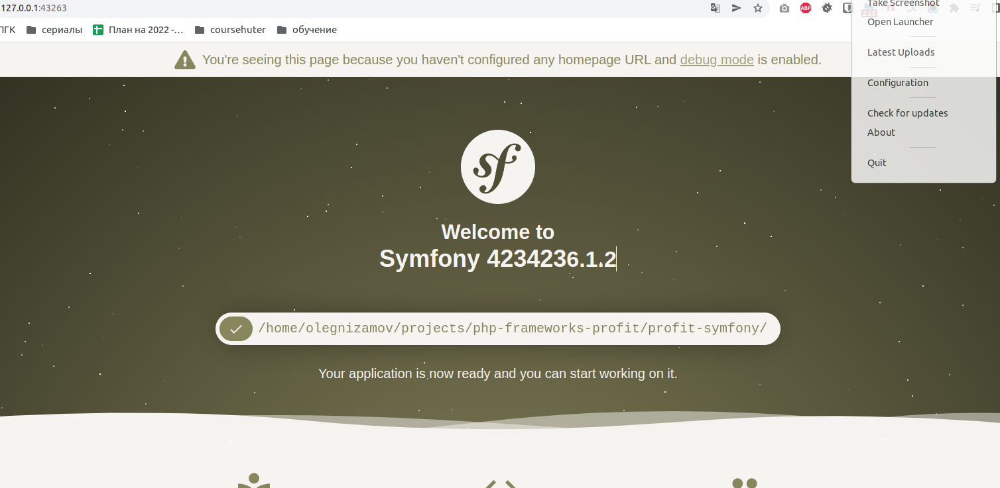
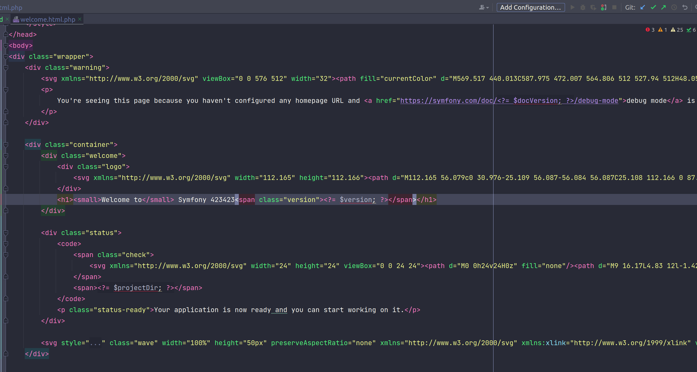

## Задание 1

**Цели:**

* Разверните, как показано на уроке, два приложения на двух фреймворках - DONE

* В каждом из приложений попробуйте найти - что нужно изменить, чтобы сменить текст на главной странице?

Laravel: Все просто - все изменения находятся в welcome.blade.php - https://github.com/olegnizamov/profit-laravel/blob/master/resources/views/welcome.blade.php

Symfony: Тут посложнее - файлы главной страницы находятся в vendor, который в .gitigone и который нельзя исправлять (модифицировать в нем код)
profit-symfony/vendor/symfony/http-kernel/Resources/welcome.html.php

* Выложите работу на GitHub или на любой другой публичный git-сервис. Вы можете создать как один общий репозиторий для двух приложений, так и два отдельных.

[Symfony](https://github.com/olegnizamov/profit-symfony)

[Laravel](https://github.com/olegnizamov/profit-laravel)

* Снабдите свою работу файлом readme.md, в котором опишите - что именно вы сделали. - DONE
